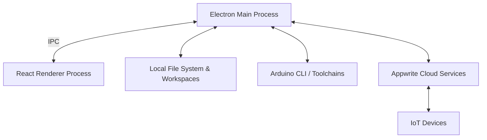

# Architecture Overview

Tantalum IDE is a hybrid desktop application designed to bridge the gap between local hardware development and cloud-connected firmware deployment. It leverages web technologies for the UI, Node.js for local system integrations, and Appwrite for cloud services.

## High-Level Architecture

### 1. The Desktop Application (Electron)

Tantalum IDE relies on the standard Electron architecture, split into two main processes:

- **Main Process (`main.js`):** Runs in a Node.js environment. It handles high-privilege operations such as:
  - Reading/writing local files and managing the user's workspace.
  - Spawning child processes (like the Arduino CLI) via `arduinoHandler.js`.
  - Handling secure credentials and Appwrite authentication.
  - Communicating directly with the Appwrite cloud via server SDKs where needed.
- **Renderer Process (`renderer-react/`):** A modern React application built with Vite and TypeScript. It includes:
  - The UI components for workspace management, board tracking, and OTA updates.
  - Monaco Editor for robust C/C++ (Arduino sketch) editing.
  - Inter-Process Communication (IPC) calls to request file system actions or compilation from the Main process.
- **Preload Script (`preload.js`):** Acts as a secure bridge between the Main and Renderer processes, exposing only explicitly allowed IPC channels (e.g., `window.api.compileSketch(...)`) to prevent arbitrary Node.js execution in the UI.

### 2. Hardware Tooling Integration

- **Arduino CLI (`arduinoHandler.js`):** The IDE does not reinvent hardware compilation; instead, it orchestrates the official [Arduino CLI](https://arduino.github.io/arduino-cli/). The Main process dynamically downloads or locates the Arduino CLI, installs required board support packages (like `esp32` or `esp8266`), and triggers compilation commands securely.
- **Tantalum Runtime:** Sketches developed within the IDE are compiled against the Tantalum Runtime (versioned and managed by the IDE). The runtime provides the underlying OTA, MQTT, and provisioning capabilities that allow hardware to securely connect to the Appwrite backend.

### 3. Appwrite Cloud Backend & Schemas

The Tantalum cloud infrastructure is built on [Appwrite](https://appwrite.io/).

- **Authentication:** Desktop users authenticate against Appwrite, granting them scoped access to their projects.
- **Storage (`firmware_bucket`):** Compiled `.bin` files are securely uploaded to Appwrite Storage. Once marked for deployment, the Device Gateway function provisions download URLs for the boards.
- **Appwrite Functions (`functions/`):**
  - `board-admin` & `device-gateway`: Handle OTA update lifecycles, telemetry, and board provisioning.
  - `agent-settings`, `agent-gateway`, `board-detection`: Handle AI integration logic, abstracting provider API keys and validating usage.

**Database Structure (ID: `697b8f660033fffde4be`)**
The database is heavily structured and categorized into distinct domains:
- **Core / Hardware Tables:**
  - `Boards`: IoT devices tracking status, firmware desired state, token hashes, and MQTT topics.
  - `Firmwares`: The versioned `.bin` firmware artifacts linked to boards.
  - `Board Source Snapshots`: Snapshots of the source code used to build firmware.
  - `Sketches`: Cloud-synced Arduino sketches.
- **Agentic AI Tables:**
  - `Agent Settings` / `Agent User Preferences`: AI configuration.
  - `Agent Managed Key Pool` / `Agent User Managed Keys` / `Agent Custom Credentials`: Securely stores API keys (encrypted via KEK envelopes) for the Tantalum AI layer.
  - `Agent Credit Accounts` / `Agent Usage Ledger`: Tracking usage limits and billing.
  - `Agent Threads` / `Agent Thread Messages` / `Agent Async Read Results`: Chat histories and async task tracking.
  - `Utility AI Model Pool` / `Board Detection Cache` / `Board Detection Usage`: specialized models for tasks like detecting board types from serial output.
- **Cloud Sync / Workspaces:**
  - `Cloud Projects` / `Cloud Project Devices` / `Cloud Project Sync Events`: Tracking Gitea sync status and devices attached to projects.
- **Admin / System:**
  - `Desktop Auth Grants`, `User Entitlements`, `Support Tickets`, `Admin Operation Runs`, `Admin Audit Events`.

### 4. VPS Infrastructure & Vertical Scaling

Tantalum employs a dual-VPS architecture on Azure to separate concerns:
1. **Appwrite VPS (`rg-tantalum-appwrite-prod`):** Hosts the main Appwrite stack. We use a **Vertical Scaling** method (via PowerShell scripts like `resize-vm.ps1`) to move between predefined VM tiers (Cost -> Baseline -> Growth -> Surge) based on current load, rather than complex horizontal auto-scaling, keeping costs predictable.
2. **Gitea & MQTT VPS (`rg-tantalum-git-prod`):** A dedicated lightweight VM for handling heavy Git operations (workspace cloud sync) and the Mosquitto MQTT broker for push-based OTA.

### 5. Over-The-Air (OTA) Delivery & MQTT Architecture

Firmware updates are shipped over-the-air using a hybrid Polling / MQTT model:
1. **Compilation & Upload:** Code is built locally and `.bin` is uploaded to Appwrite Storage.
2. **Deployment:** The user triggers a deployment, updating the desired state in the database.
3. **Notification (MQTT):** The Appwrite `board-admin` function publishes a command to a dedicated Mosquitto MQTT broker hosted on the VPS (over TLS port 8883) to topic `tantalum/boards/+/+/cmd`.
4. **Download:** The IoT board receives the MQTT message, securely fetches the new firmware URL from the `device-gateway`, and applies the update.

### 6. Tantalum AI Layer (Agentic Integration)

Tantalum features a deeply integrated Agentic AI assistant. While it utilizes the OpenCode SDK (`@opencode-ai/sdk`) under the hood, we have built a substantial **Tantalum AI Layer** on top of it (`src/agent/opencodeRuntimeManager.js`):
- **Command Canonicalization:** Normalizes commands across different OSs (Windows/Mac/Linux) and terminals.
- **Tool Executor & Sandboxing:** Validates tool usage (e.g., file reads/writes) against strict workspace boundaries. It uses `securityManager.js` to ensure the AI cannot access secrets or `.env` files.
- **Restore Points:** Before any AI operation that modifies files, the layer automatically creates a Git-based restore point (`restorePointStore.js`), allowing users to revert the AI's changes instantly if they are incorrect.
- **API Key Abstraction:** Keys are managed securely via Appwrite (encrypted with a Master KEK). The local UI never sees the API keys; the `agent-gateway` proxy securely attaches them to requests.
