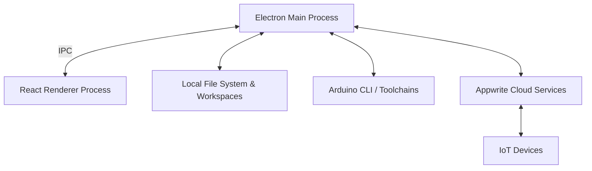

# Architecture Overview

Tantalum IDE is a hybrid desktop application designed to bridge the gap between local hardware development and cloud-connected firmware deployment. It leverages web technologies for the UI, Node.js for local system integrations, and Appwrite for cloud services.

## High-Level Architecture

### 1. The Desktop Application (Electron)

Tantalum IDE relies on the standard Electron architecture, split into two main processes:

- **Main Process (`main.js`):** Runs in a Node.js environment. It handles high-privilege operations such as:
  - Reading/writing local files and managing the user's workspace.
  - Spawning child processes (like the Arduino CLI) via `arduinoHandler.js`.
  - Handling secure credentials and Appwrite authentication.
  - Communicating directly with the Appwrite cloud via server SDKs where needed.
- **Renderer Process (`renderer-react/`):** A modern React application built with Vite and TypeScript. It includes:
  - The UI components for workspace management, board tracking, and OTA updates.
  - Monaco Editor for robust C/C++ (Arduino sketch) editing.
  - Inter-Process Communication (IPC) calls to request file system actions or compilation from the Main process.
- **Preload Script (`preload.js`):** Acts as a secure bridge between the Main and Renderer processes, exposing only explicitly allowed IPC channels (e.g., `window.api.compileSketch(...)`) to prevent arbitrary Node.js execution in the UI.

### 2. Hardware Tooling Integration

- **Arduino CLI (`arduinoHandler.js`):** The IDE does not reinvent hardware compilation; instead, it orchestrates the official [Arduino CLI](https://arduino.github.io/arduino-cli/). The Main process dynamically downloads or locates the Arduino CLI, installs required board support packages (like `esp32` or `esp8266`), and triggers compilation commands securely.
- **Tantalum Runtime:** Sketches developed within the IDE are compiled against the Tantalum Runtime (versioned and managed by the IDE). The runtime provides the underlying OTA, MQTT, and provisioning capabilities that allow hardware to securely connect to the Appwrite backend.

### 3. Appwrite Cloud Backend

The Tantalum cloud infrastructure is built on [Appwrite](https://appwrite.io/).

- **Authentication:** Desktop users authenticate against Appwrite, granting them scoped access to their projects.
- **Database (`boards`, `firmwares`, `sketches`):** Uses Appwrite's document database with Row-Level Security (RLS) to ensure users can only see and manage their own hardware.
- **Storage (`firmware_bucket`):** Compiled `.bin` files are securely uploaded to Appwrite Storage. Once marked for deployment, the Device Gateway function provisions download URLs for the boards.
- **Appwrite Functions (`functions/`):**
  - `board-admin` & `device-gateway`: Handle OTA update lifecycles, telemetry, and board provisioning.
  - `agent-settings`, `agent-gateway`, `board-detection`: Handle AI integration logic, abstracting provider API keys and validating usage.

### 4. Over-The-Air (OTA) Delivery & MQTT

Firmware updates are shipped over-the-air using a hybrid Polling / MQTT model:
1. **Compilation:** Code is built locally by the Electron Main Process.
2. **Upload:** The `.bin` is uploaded to Appwrite Storage.
3. **Deployment:** The user triggers a deployment. Appwrite updates the desired state in the database.
4. **Notification:** If MQTT is configured, the Appwrite `board-admin` function publishes a command to a secure MQTT broker.
5. **Download:** The IoT board receives the MQTT message, securely fetches the new firmware URL from the `device-gateway`, and applies the update.

### 5. Agentic AI Integration

The IDE integrates an AI assistant (`@opencode-ai/sdk`, `@ai-sdk/openai-compatible`) that operates contextually:
- The Renderer process gathers contextual data (current active file, compiler errors, serial monitor output).
- The Main process routes these queries securely to the Appwrite `agent-gateway`.
- The gateway proxy ensures API keys are not exposed to the client and enforces rate limits.
