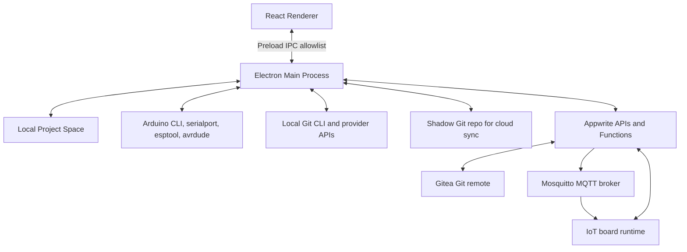

# Architecture Overview

Tantalum IDE is a hybrid desktop application designed to bridge the gap between local hardware development and cloud-connected firmware deployment. It leverages web technologies for the UI, Node.js for local system integrations, and Appwrite for cloud services.

## High-Level Architecture



### 1. The Desktop Application (Electron)

Tantalum IDE relies on the standard Electron architecture, split into two main processes:

- **Main Process (`main.js`):** Runs in a Node.js environment. It handles high-privilege operations such as:
  - Reading/writing local files and managing the user's workspace.
  - Spawning child processes (like the Arduino CLI) via `arduinoHandler.js`.
  - Spawning Git CLI commands for the active workspace and calling GitHub/GitLab APIs for repository publishing.
  - Handling secure credentials and Appwrite authentication.
  - Communicating directly with the Appwrite cloud via server SDKs where needed.
- **Renderer Process (`renderer-react/`):** A modern React application built with Vite and TypeScript. It includes:
  - The UI components for workspace management, board tracking, and OTA updates.
  - Monaco Editor for robust C/C++ (Arduino sketch) editing.
  - Source-control panels for working-tree changes, diffs, commit history, branches, remotes, and repository publishing.
  - Inter-Process Communication (IPC) calls to request file system actions or compilation from the Main process.
- **Preload Script (`preload.js`):** Acts as a secure bridge between the Main and Renderer processes, exposing only explicitly allowed IPC channels such as `window.tantalum.toolchain.*`, `window.tantalum.cloudSync.*`, and `window.tantalum.git.*` to prevent arbitrary Node.js execution in the UI.

### 2. Hardware Tooling Integration

- **Arduino CLI (`arduinoHandler.js`):** The IDE does not reinvent hardware compilation; instead, it orchestrates the official [Arduino CLI](https://arduino.github.io/arduino-cli/). The Main process locates a bundled or installed CLI, prepares a temporary CLI config, installs board platforms and libraries, streams compile/upload output to the renderer, and returns built `.bin` or `.hex` data.
- **Serial and readback tools:** `serialport` is used for port enumeration, Serial Monitor, USB WiFi provisioning, and port availability checks. ESP readback uses the ESP board package's `esptool`; AVR readback uses `avrdude`; disassembly uses the relevant objdump tool from the installed Arduino core.
- **Tantalum Runtime:** Sketches developed within the IDE can be compiled against the Tantalum Runtime. The runtime provides OTA polling, MQTT command handling, telemetry, secure WiFi provisioning, and source marker persistence.

### 3. Auto Board Detection Pipeline

Auto board detection is split into deterministic local detection and optional AI fallback.

1. The renderer requests `toolchain:detect-local-boards` through the preload bridge.
2. `main.js` calls `detectLocalBoardsDeterministic()` in `src/services/localBoardService.js`.
3. The service runs `arduino-cli board list` in JSON mode and also reads `serialport` metadata. These two data sources are merged because Arduino CLI often knows the matching board candidates while `serialport` has better USB identity data.
4. Port paths are normalized across platforms. On macOS, `/dev/tty.*` paths are converted to `/dev/cu.*` callout paths where possible, while physical keys collapse both names to the same logical device.
5. Candidates are keyed by trusted hardware identity: serial number, PnP ID, location ID, VID/PID, or physical port. This is what lets saved local profiles reconnect even when a COM port changes.
6. Confidence is assigned from Arduino CLI matches. A single concrete FQBN is high confidence, multiple matches are medium confidence, and metadata-only USB serial devices are low confidence.
7. ESP-family candidates can be probed with the installed `esptool chip_id`. If the chip target is found, the candidate is upgraded to a concrete ESP32 FQBN with high confidence.
8. If the board is still ambiguous, `main.js` can invoke the Appwrite `board-detection` function. The function fingerprints the candidate, serves high-confidence cache hits from `board_detection_cache`, and otherwise queries the configured `utility_ai_model_pool`. Usage is written to `board_detection_usage`.

Local board profiles are stored in Electron preferences under `localBoardProfiles`. Profiles include FQBN, port, labels, USB identity, confidence, cloud board link, OTA update mode, and source-code visibility.

### 4. Compile, Upload, and Runtime Injection

`arduinoHandler.js` owns the compile/upload pipeline. The IDE writes a temporary sketch directory for each build, prepares an isolated Arduino CLI config, streams output to the renderer, and cleans up temporary build directories.

When cloud runtime support is enabled, Tantalum injects generated runtime code into the temporary sketch, not into the user's saved files:

- `TantalumCloudRuntime.h` is copied from `resources/firmware/`.
- Runtime macros include board ID, API token, Appwrite endpoint, project ID, device-gateway function ID, firmware ID/version, MQTT host/topic/credentials, TLS CA certs, provisioning proof-of-possession, hostname, and OTA mode.
- The user's `setup()` and `loop()` are wrapped into Tantalum-managed callbacks so the runtime can run WiFi, heartbeat, OTA, MQTT, provisioning, and user code cooperatively.
- Required libraries are installed before compile. `ArduinoJson` is always required for runtime builds, and `PubSubClient` is installed when MQTT is enabled.
- USB uploads are locked per port so compile/upload, Serial Monitor, and code readback cannot use the same serial device at the same time.

For source recovery, the same build pipeline can inject `TantalumSourceMarker.cpp`. After compile, Tantalum scans generated `.bin` or `.hex` artifacts and fails the build if the marker was optimized out.

### 5. Appwrite Cloud Backend & Schemas

The Tantalum cloud infrastructure is built on [Appwrite](https://appwrite.io/).

- **Authentication:** Desktop users authenticate against Appwrite. Long-lived desktop login handoff is handled through `desktop-auth` grants.
- **Storage:** `firmware_bucket` stores compiled firmware artifacts. `firmware_source_bucket` stores zipped source snapshots used by View Code.
- **Appwrite Functions (`functions/`):**
  - `board-admin`: Creates boards, rotates board tokens, queues deployments, starts provisioning, and publishes signed MQTT commands.
  - `device-gateway`: Receives heartbeats, check-update calls, telemetry, and OTA results from runtime firmware.
  - `agent-settings` and `agent-gateway`: Manage agent preferences, model credentials, credit accounting, and provider proxying.
  - `board-detection`: Provides AI-assisted board FQBN suggestions with cache and usage tracking.
  - `project-sync`: Creates/links Gitea-backed cloud projects, records sync events, and manages device SSH keys.
  - `desktop-auth` and `web-admin`: Support desktop login flows and administrative operations.

**Database Structure (ID: `697b8f660033fffde4be`)**
The database is heavily structured and categorized into distinct domains:

**Core / Hardware Tables:**
- `Boards`: Manages IoT devices, tracking online status, desired firmware state, token hashes, MQTT topic suffixes, encrypted command secrets, provisioning proof-of-possession, OTA mode, and source-code visibility.
- `Firmwares`: Stores versioned firmware metadata, storage file IDs, checksums, deployed state, notes, and optional source snapshot references.
- `Board Source Snapshots`: Stores source marker documents with `markerId`, source zip file ID, checksum, manifest, status, retention group, visibility, `flashedVia`, board identity, upload ID, firmware ID, and created/applied timestamps.
- `Sketches`: Stores individual Arduino sketches that are synced to the cloud.

**Agentic AI Tables:**
- `Agent Settings`: Global configuration for the Tantalum AI layer.
- `Agent User Preferences`: Per-user overrides for AI behavior and UI presentation.
- `Agent Managed Key Pool`: Provider keys managed by the platform for users without their own keys.
- `Agent User Managed Keys`: Per-user assignment to managed key-pool entries.
- `Agent Custom Credentials`: User-owned OpenAI-compatible credentials and model lists, stored with encrypted secret envelopes.
- `Agent Credit Accounts`: Monthly managed-agent credit allowances and reset periods.
- `Agent Usage Ledger`: Token/credit usage and failure records.
- `Agent Threads`: Conversational or task-based AI sessions.
- `Agent Thread Messages`: Individual prompts, replies, and tool results.
- `Agent Async Read Results`: Short-lived async function outputs.
- `Utility AI Model Pool`: Model configs for utility tasks such as board detection.
- `Board Detection Cache`: Cached board detection suggestions by hardware fingerprint.
- `Board Detection Usage`: Analytics and token spend for board detection.

**Cloud Sync / Workspaces Tables:**
- `Cloud Projects`: Synchronized IDE workspaces with Gitea repo metadata.
- `Cloud Project Devices`: Devices authorized to access a cloud project.
- `Cloud Project Sync Events`: Push, pull, link, conflict, and failure audit records.

**Admin / System Tables:**
- `Desktop Auth Grants`: Secure desktop login grants.
- `User Entitlements`: Feature access, beta flags, and storage limits.
- `Support Tickets`: In-app support submissions.
- `Admin Operation Runs`: Administrative automation records.
- `Admin Audit Events`: Immutable audit events for sensitive operations.

### 6. Source Snapshot and Code Recovery Architecture

View Code is marker-backed source restore, not binary decompilation.

1. The renderer builds a `sourceSnapshot` payload from the current Project Space or active sketch before USB upload or OTA release.
2. The main process creates a zip with `tantalum-source-manifest.json`, normalized source files, metadata, and a SHA-256 checksum.
3. For cloud-backed builds, `createPendingSourceRestoreMarker()` stores the zip in `firmware_source_bucket` and creates a `board_source_snapshots` document with status `pending`.
4. The compile pipeline injects a marker literal in `TantalumSourceMarker.cpp`:
   ```text
   TANTALUM_SOURCE_SNAPSHOT_V1::<markerId>::<snapshotChecksum>::END
   ```
5. Successful flashing promotes the marker document to `current`. Existing `current` snapshots in the same retention group are demoted to `previous`, and older pending/previous documents are pruned. This keeps the latest two restorable snapshots for a board.
6. Listing snapshots for a connected board reads firmware from flash, scans the active ESP app image or AVR flash image for the marker, then fetches only matching current/previous documents that the user can read.
7. Restoring a snapshot downloads the source zip, verifies checksum equality with the cloud document and firmware marker, validates board identity, and writes files into either `extracted-board-code/<board>-<timestamp>` or a new Project Space.
8. If no marker is available, the IDE can show unverified current cloud snapshots for the selected cloud board. USB uploads also save local source history on this machine, keyed by profile, fingerprint, cloud board, and port, so recovery code has a local fallback when exact cloud marker restore is not available.

Snapshot manifests are identity-scoped. They include board type, cloud board ID, local profile ID, hardware fingerprint, port, active file, sketch root, upload operation, source visibility, and marker metadata. Broad workspace snapshots are rejected to avoid restoring unrelated Project Space files.

### 7. OTA, MQTT, Provisioning, and Telemetry

Firmware updates use a hybrid polling/MQTT model:

1. The desktop compiles locally, calculates a SHA-256 checksum, uploads the artifact to `firmware_bucket`, and creates a `firmwares` document.
2. `board-admin` marks the firmware as deployed, updates the board's desired firmware fields, and records a deployment ID.
3. If the board's OTA mode is `mqtt` or `both`, `board-admin` publishes a signed command to `tantalum/boards/<boardId>/<topicSuffix>/cmd` on the TLS Mosquitto broker.
4. If the board's OTA mode is `polling` or `both`, the runtime can also discover pending updates through `device-gateway` heartbeat or `/check-update`.
5. `device-gateway` validates the board API token hash, creates signed OTA commands with firmware size/checksum/download URL, and receives OTA result reports.
6. The runtime downloads firmware through the device gateway's storage URL, verifies metadata, applies the update, and reports success or failure.

Provisioning has two separate stages:

- **Runtime install:** The desktop flashes runtime firmware over USB. Board secrets are injected into the temporary build, not stored in user source files. ESP32 native USB boards are compiled with USB CDC options where needed, and NVS/Preferences are preserved so WiFi credentials survive runtime reinstalls.
- **WiFi transfer:** USB provisioning sends a signed JSON command over serial. The command is HMAC-SHA256 signed with the board command secret. The board validates the signature, connects to WiFi, and returns accepted/connected/failed messages over serial. BLE/SoftAP provisioning uses the runtime's proof-of-possession value.

WiFi credentials are not uploaded to Appwrite and are not stored by the desktop.

### 8. Built-In Git Source Control

Tantalum's source-control UI works directly against the active Project Space repository. This is intentionally separate from Project Cloud Sync: source control uses the user's real `.git` folder, while cloud sync uses a shadow repository so backup/sync never rewrites user history.

1. The renderer owns the interaction model through `useGitWorkspaceController`, `GitSourceControlPanel`, `GitWorkspace`, and `GitHistoryPanel`.
2. The preload bridge exposes `window.tantalum.git` methods for status, diff, stage, unstage, discard, commit, fetch, pull, push, branch listing, checkout, branch creation, log, remotes, safe-directory repair, repository initialization, repository publishing, and configuration.
3. `main.js` handles the IPC calls by spawning the local `git` executable with `GIT_TERMINAL_PROMPT=0`, so commands fail cleanly instead of hanging on credential prompts.
4. Status is parsed from `git status --porcelain=v2 --branch --untracked-files=all`, which lets the UI separate staged files, unstaged files, untracked files, conflicts, current branch, upstream, ahead/behind counts, detached HEAD, and active operations such as merge, rebase, cherry-pick, revert, or bisect.
5. Diff views are built by reading `HEAD` or index objects with `git show` and pairing them with either staged content or workspace file content. File paths are normalized and blocked if they escape the active Project Space.
6. Mutating actions are narrow wrappers around ordinary Git commands: `git add`, `git restore --staged`, `git restore --worktree`, `git commit -m`, `git fetch --prune`, `git pull --ff-only`, `git push`, `git checkout`, and `git checkout -b`.
7. Destructive operations are user-confirmed in the UI. Untracked discard removes files from disk only after path normalization confirms they are inside the active Project Space.
8. Repository health states are surfaced explicitly: no workspace, missing Git, not a repository, unsafe `safe.directory`, no upstream, authentication failure, merge/rebase conflicts, and general Git command failures.
9. Git configuration is split between global Git config and the desktop secret store. Author name/email are written through `git config --global`; GitHub/GitLab provider selection, usernames, and personal access tokens are stored in the local secret store.
10. Repository publishing can create a GitHub or GitLab remote through the provider API, initialize the local repository if needed, create an initial commit when no `HEAD` exists, set `origin`, and push the active branch with an in-memory authorization header. Provider tokens are not persisted into the repository remote URL.
11. Commit history uses `git log --all --topo-order --source --decorate=short --numstat` and the renderer's `gitCommitGraph` helpers to display a branch graph, refs, authors, avatars, and file-change statistics.

Agent Git tools share the same guarded main-process wrappers for diff, stage, commit, branch, pull, and push so AI-assisted Git operations observe the same workspace boundary and command handling rules.

### 9. Project Cloud Sync

Cloud sync uses a shadow Git repository to avoid mutating the user's own Git history. It is a cloud backup/synchronization service, not the same thing as the built-in source-control panel.

1. `cloudSyncService` scans the workspace, applying `.tantalumignore` and built-in exclusions such as `.git`, build outputs, `node_modules`, and Tantalum trash folders.
2. Existing Git workspaces are scanned read-only; Tantalum does not stage, commit, or rewrite the user's repository.
3. Included files are copied into a shadow repo under app data, and `.tantalum-sync/manifest.json` records file paths, sizes, mtimes, checksums, excluded samples, and scan statistics.
4. The shadow repo commits changes, rebases against the remote Gitea branch, pushes, and then applies the remote tracked file set back into the Project Space.
5. Conflicts are detected when linking or rebasing would overwrite differing local files. Sync state and conflict paths are persisted locally and recorded remotely through `cloud_project_sync_events`.

### 10. VPS Infrastructure & Vertical Scaling

Tantalum employs a dual-VPS architecture on Azure to enforce security boundaries and separate heavy operational concerns:

1. **Appwrite VPS (`rg-tantalum-appwrite-prod`):** Hosts the primary Appwrite backend, Database, Storage, Functions, and Sites. We utilize a **Vertical Scaling** strategy through scripts such as `infra/azure/resize-vm.ps1`; the VM is resized between predictable tiers instead of adding horizontal load balancers for the MVP.
   - **Cost Tier:** `Standard_B2ls_v2` - Ideal for staging or single-developer environments.
   - **Baseline Tier:** `Standard_B2s_v2` - The minimum recommended production MVP tier.
   - **Growth Tier:** `Standard_B4s_v2` - For scaling to support hundreds of concurrent users.
   - **Surge Tier:** `Standard_B8s_v2` - For temporary high-load events such as fleet OTA releases.
2. **Gitea & MQTT Dedicated VPS (`rg-tantalum-git-prod`):** A secondary virtual machine for persistent connections and heavy file operations.
   - **MQTT Broker:** Runs Mosquitto with TLS on port 8883. Appwrite publishes commands with publisher credentials; boards subscribe with device credentials and ACL-limited topics.
   - **Workspace Cloud Sync:** Hosts Gitea remotes for Project Space backup and device-to-device sync.

### 11. Tantalum AI Layer (Agentic Integration)

Tantalum features a deeply integrated Agentic AI assistant. While it uses the OpenCode SDK (`@opencode-ai/sdk`) under the hood, the IDE adds a Tantalum-specific runtime in `src/agent/opencodeRuntimeManager.js`:

- **Prompt routing:** The router distinguishes quick answers, local actions, OpenCode edits, Arduino tool requests, and continuation prompts.
- **Workspace scanning:** Context is built from safe text files under the active Project Space. Sensitive files such as `.env`, keys, certificates, credentials, `.git`, and agent artifacts are excluded.
- **Tool execution:** `AgentToolExecutor` handles Arduino verify/upload, library/platform install, and Git tools. Tool calls are normalized through `toolRegistry.js`, surfaced in task lists, and can emit progress notifications.
- **Command canonicalization:** Commands are normalized across Windows, macOS, Linux shells, and terminal profiles.
- **Restore points:** `restorePointStore.js` records file-level before/after snapshots for agent changes. Users can restore to a previous agent message, and restored files are written back only inside the active Project Space.
- **Gateway policy:** `agent-gateway` resolves managed or custom OpenAI-compatible credentials, validates public HTTPS provider URLs, blocks local/private hosts, applies response-style policy, retries around provider parameter incompatibilities, and writes usage ledger entries.
- **Credit and key management:** Managed key assignments, monthly credits, token estimates, BYOK/custom credentials, and async result documents are all stored in Appwrite collections. Secret values are encrypted with KEK envelope encryption before storage.
