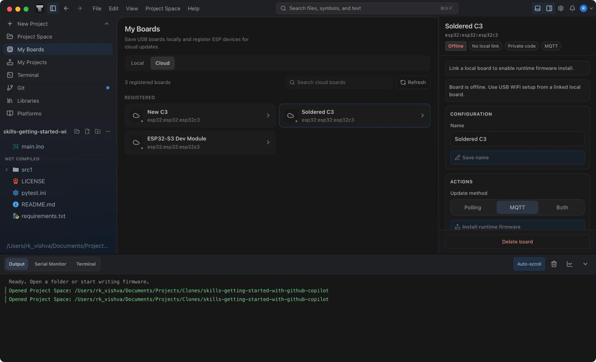
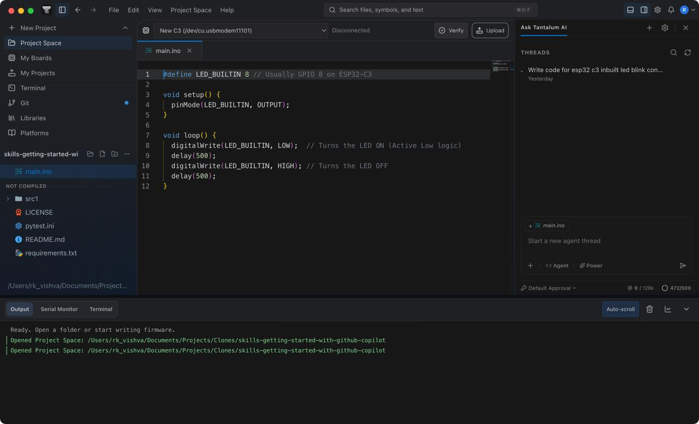
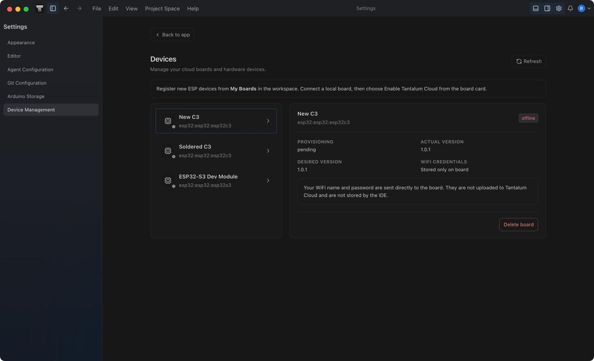

#  Tantalum IDE


Tantalum IDE is a desktop application built with Electron, React, and TypeScript. It provides a robust environment for editing Arduino sketches, managing local workspaces, compiling firmware, and shipping Over-The-Air (OTA) firmware updates via Appwrite. Tantalum IDE also features an integrated **Agentic AI coding assistant** to supercharge your hardware development workflow.

---

## 📸 Screenshots

| Workspace & Editor | AI Assistant | Firmware OTA |
|:---:|:---:|:---:|
|  |  |  |

---

## 🌐 The Tantalum Ecosystem

Tantalum is composed of three interconnected open-source projects that work together to provide a complete hardware development and deployment platform:

1. **[Tantalum IDE](https://github.com/rkvishwa/Tantalum-IDE)**: The core desktop application. It provides the code editor, local workspace management, firmware compilation (via Arduino CLI), OTA deployment orchestration, and the Agentic AI coding assistant.
2. **[Tantalum Web](https://github.com/rkvishwa/Tantalum-Web)**: The cloud portal and admin dashboard. It handles user authentication, cloud board management, firmware version tracking, AI agent settings, and administrative oversight.
3. **[Tantalum Mobile](https://github.com/rkvishwa/Tantalum-Mobile)**: The companion Android app. Used for securely provisioning WiFi credentials to IoT boards in the field via BLE or SoftAP, bridging physical hardware to your cloud account without exposing credentials.

---

## ✨ Features

- **Arduino Sketch Editing:** Full-featured code editor powered by Monaco Editor, tuned for C/C++.
- **Local Workspace Management:** Organize your projects, libraries, and sketches easily from an intuitive UI.
- **Auto Board Detection:** Detect connected Arduino-compatible boards by combining Arduino CLI metadata, USB serial metadata, ESP chip probing, and an optional AI fallback.
- **Local Board Profiles:** Save physical boards with stable hardware fingerprints, ports, FQBNs, cloud links, OTA mode, and source-code visibility preferences.
- **Project Cloud Sync:** Seamlessly sync your local workspaces to the cloud via a dedicated Git backend, ensuring code is backed up and accessible across devices.
- **Firmware Compilation:** Seamless integration with Arduino CLI for compiling and building firmware locally.
- **OTA Firmware Delivery:** Ship and deploy firmware updates directly to your boards over-the-air using Appwrite cloud synchronization and a dedicated MQTT broker.
- **Runtime Provisioning:** Install the Tantalum runtime firmware, then send WiFi credentials directly to boards over USB, BLE, or SoftAP without storing WiFi passwords in the cloud.
- **Code Recovery / View Code:** Restore exact source snapshots from Tantalum-flashed boards using an embedded firmware marker and cloud source snapshots, with local USB upload history retained on the desktop.
- **Serial Monitor & Plotter:** Monitor serial output, parse numeric streams, and detect serial-port blockers before uploads or firmware readback.
- **Agentic AI Coding Assistant:** Built-in AI helper powered by the **Tantalum AI Layer** (built on top of the OpenCode SDK), handling tool execution, sandboxing, and secure API key management to assist with code generation, debugging, and project structuring.
- **Cross-Platform:** Available for macOS, Windows, and Linux.

---

## Technical Feature Details

### Auto Board Detection

Tantalum's auto-detect flow is deterministic first and AI-assisted only when needed:

1. The renderer calls `window.tantalum.toolchain.detectLocalBoards(...)`, which is handled in `main.js` and delegated to `src/services/localBoardService.js`.
2. The local scanner reads `arduino-cli board list --format json` and `serialport` metadata, then merges both views of the same USB device.
3. Ports are normalized across platforms, including macOS `/dev/tty.*` to `/dev/cu.*` callout handling, and grouped by stable hardware identity such as serial number, PnP ID, location ID, VID/PID, or physical port.
4. Arduino CLI FQBN matches are scored as high, medium, or low confidence. ESP devices can be probed with the installed `esptool chip_id` tool to turn broad matches like "ESP32 Family" into a concrete FQBN such as `esp32:esp32:esp32c3`.
5. If the result is still ambiguous, the Appwrite `board-detection` function can call a configured utility AI model. That function hashes the board metadata into a fingerprint, checks `board_detection_cache`, records usage in `board_detection_usage`, and only returns strict JSON containing `fqbn`, `boardLabel`, `confidence`, and `reason`.

Saved local boards are stored as local profiles with the detected FQBN, port, manufacturer, VID/PID, serial number, fingerprint, cloud board link, OTA mode, and source-code visibility. Profile matching favors trusted identities over raw port paths, so a board can be recognized again after reconnecting on a different COM port.

### Runtime Injection, Build, and Upload

Compilation is performed by Arduino CLI, but Tantalum builds a temporary sketch workspace before every verify, USB upload, or OTA release. When cloud runtime support is enabled, the build pipeline injects:

- `TantalumCloudRuntime.h` from `resources/firmware/`
- compile-time macros for board ID, API token, Appwrite endpoint/project, device-gateway function ID, firmware ID/version, MQTT settings, TLS CA certs, provisioning proof-of-possession, and hostname
- required Arduino libraries such as `ArduinoJson` and, for MQTT modes, `PubSubClient`
- wrapper code that preserves the user's `setup()` and `loop()` logic as Tantalum-managed callbacks

Uploads and firmware releases stream Arduino CLI output back to the UI, track active operations per serial port, and block unsafe overlaps such as uploading while Serial Monitor or code readback is using the same port.

### Code Recovery / View Code

Tantalum does not pretend compiled firmware can be decompiled into exact Arduino source. Instead, exact recovery works by saving and later proving source snapshots:

1. Before a Tantalum USB upload or OTA release, the IDE collects the uploaded source files and creates a zip containing `tantalum-source-manifest.json`.
2. For cloud-backed uploads, that zip is stored in `firmware_source_bucket` and a `board_source_snapshots` document is created with a generated `source_...` marker ID, SHA-256 checksum, board identity, visibility, status, and retention group.
3. The compiler injects `TantalumSourceMarker.cpp` with an ASCII marker literal:
   ```text
   TANTALUM_SOURCE_SNAPSHOT_V1::<markerId>::<snapshotChecksum>::END
   ```
   The marker is placed in a used read-only section and the build fails if the marker is not present in the generated `.bin` or `.hex`.
4. When flashing succeeds, the marker document is promoted from `pending` to `current`. The previous `current` snapshot becomes `previous`, and older snapshots in the same retention group are pruned. This is why View Code normally shows the latest two snapshots: current and previous.
5. When View Code runs against a connected board, the IDE reads firmware using the board package tools (`esptool` for ESP, `avrdude` for AVR), scans the active application image for the marker, downloads the matching source zip, verifies the checksum, validates board identity, and restores the files into the current Project Space or a new Project Space.
6. If firmware marker verification is unavailable, the IDE can show unverified cloud snapshots for the selected cloud board. USB uploads also save local source history on this machine, keyed by profile, fingerprint, cloud board, and port, so recovery code has a local fallback when exact cloud marker restore is not available.

### OTA, Provisioning, and Telemetry

Cloud boards are registered through the `board-admin` function. The function stores only token hashes and encrypted command secrets in Appwrite, while returning the one-time API token, MQTT topic, command secret, and provisioning proof-of-possession to the desktop.

The Tantalum runtime supports three OTA modes:

- `polling`: boards ask `device-gateway` for updates during heartbeat or check-update calls.
- `mqtt`: `board-admin` publishes signed MQTT commands and boards react immediately.
- `both`: MQTT is used for fast delivery, with polling as a fallback.

OTA commands are HMAC-signed, include deployment and firmware metadata, and point boards at a device-gateway-generated firmware download URL. Boards report heartbeat, runtime version, firmware version, OTA status, and OTA result back through `device-gateway`.

WiFi provisioning is designed so credentials do not pass through Appwrite. For USB provisioning, the desktop writes a signed JSON command to the serial port. The runtime validates the HMAC with the board command secret, attempts WiFi connection, and reports accepted/connected/failed status back over serial. Runtime firmware also supports provisioning mode through BLE or SoftAP where the board and mobile app use the board's proof-of-possession.

### Project Cloud Sync

Workspace sync uses a shadow Git repository instead of committing directly inside the user's project. `src/services/cloudSyncService.js` scans the workspace, applies `.tantalumignore` and core ignore rules, copies allowed files into the shadow repo, writes `.tantalum-sync/manifest.json`, commits, rebases with the remote Gitea repository, pushes, and then applies remote changes back into the workspace. Existing Git workspaces are scanned read-only so Tantalum does not mutate the user's own Git history.

### Agentic AI Layer

The AI assistant routes prompts through the Tantalum agent runtime and Appwrite agent functions. The desktop side manages workspace context, prompt routing, tool execution, command canonicalization, and local restore points. The cloud side resolves managed or user-provided model credentials, validates public HTTPS provider endpoints, injects output policy, tracks credits, and records usage in the agent ledger. Agent tools can verify/upload Arduino sketches, install libraries/platforms, and run Git actions while respecting workspace boundaries and user approvals.

---

## 🚀 Getting Started

### Prerequisites

- [Node.js](https://nodejs.org/) (v18 or higher)
- [npm](https://www.npmjs.com/) (v9 or higher)
- [Arduino CLI](https://arduino.github.io/arduino-cli/) (installed and accessible in PATH or bundled in `resources/arduino-cli`)

### Installation & Local Development

1. **Clone the repository:**
   ```bash
   git clone https://github.com/yourusername/tantalum-ide.git
   cd tantalum-ide
   ```

2. **Install dependencies:**
   ```bash
   npm install
   ```

3. **Start the development server:**
   ```bash
   npm run dev
   ```
   This command starts both the React renderer (via Vite) and the Electron main process concurrently.

4. **Build for production:**
   ```bash
   # Build for your current OS
   npm run dist
   
   # Or explicitly build for macOS
   npm run build:mac
   ```

---

## 🛠 Scripts

Here are the primary scripts available in `package.json`:

- `npm run dev` - Start the development environment (React + Electron).
- `npm run start` - Start the built Electron app.
- `npm run build:renderer` - Build the React frontend.
- `npm run dist` - Build and package the application using electron-builder.
- `npm run selfhost:seed` - Seed Appwrite collections for self-hosting.
- `npm run secret:encrypt-api-key` - Encrypt API keys for Appwrite functions.
- `npm run smoke:*` - Various smoke tests for integration and functionality.

---

## 🌍 Self-Hosting Guide

Self-hosting Tantalum's backend provides complete data privacy, full control over your telemetry, and avoids costly cloud vendor lock-in for your IoT fleet. Tantalum IDE uses Appwrite as its primary backend for OTA firmware updates, authentication, and cloud synchronization. Follow these steps to self-host the Appwrite backend.

### 1. Appwrite CLI Setup & VPS Infrastructure

Tantalum IDE uses Azure Virtual Machines for its cloud backend. We employ a **Vertical Scaling strategy** to manage costs effectively without the complexity of horizontal auto-scaling and load balancers.

For the Appwrite backend, use the provided `docs/azure-selfhost-appwrite.md` runbook. It provisions an Azure VM (starting at `Standard_B2s_v2` for the baseline MVP), mounts a 256 GB Appwrite data disk, installs backup scripts, and seeds the necessary environment variables.

If your workload increases, use the included PowerShell scaling scripts (e.g., `infra/azure/resize-vm.ps1`) to vertically scale the Appwrite VPS through predefined tiers:
- **Cost Tier:** `Standard_B2ls_v2` (for light/staging workloads)
- **Baseline Tier:** `Standard_B2s_v2` (Current MVP)
- **Growth Tier:** `Standard_B4s_v2` (First upgrade step for scaling)
- **Surge Tier:** `Standard_B8s_v2` (For temporary high-load periods)

The Appwrite CLI for production should target:
- **endpoint:** `https://fra.cloud.appwrite.io/v1`
- **project:** `tantalum`

### 2. Project Migration (If Applicable)

If you are migrating from an older project, use Appwrite Console migration first for Auth users, databases, rows, storage files, functions, and sites. 

After the Console migration, verify counts from this repo without printing secrets:
```powershell
$env:SOURCE_APPWRITE_API_KEY = "<old project admin key>"
$env:TARGET_APPWRITE_API_KEY = "<new project admin key>"
npm run migrate:appwrite-project
```

Fallback copy (dry-run first):
```powershell
npm run migrate:appwrite-project -- --copy-all
# Apply if dry-run is correct:
npm run migrate:appwrite-project -- --copy-all --yes
```

### 3. Deploy Functions

Appwrite Functions are scaffolded under `functions/`:
- `board-admin`
- `device-gateway`
- `agent-settings`
- `agent-gateway`
- `board-detection`

Deploy these using the Appwrite CLI. Ensure that function variables are set correctly:
- `board-admin`: `APPWRITE_DATABASE_ID`, `APPWRITE_BOARDS_COLLECTION_ID`, `APPWRITE_FIRMWARE_COLLECTION_ID`
- `device-gateway`: `APPWRITE_DATABASE_ID`, `APPWRITE_BOARDS_COLLECTION_ID`, `APPWRITE_FIRMWARE_COLLECTION_ID`, `APPWRITE_FIRMWARE_BUCKET_ID`, `TANTALUM_APPWRITE_PUBLIC_ENDPOINT`
- `agent-settings` & `agent-gateway`: `APPWRITE_DATABASE_ID` plus agent collection IDs and `AGENT_DEFAULT_MONTHLY_CREDITS`
- `board-detection`: `APPWRITE_DATABASE_ID`, `APPWRITE_UTILITY_AI_MODEL_POOL_COLLECTION_ID`, and board-detection cache/usage collection IDs
- Source snapshot restore also requires the `board_source_snapshots` collection and `firmware_source_bucket` storage bucket.

### 4. MQTT OTA Delivery Architecture (Dedicated VPS)

Tantalum requires a dedicated lightweight VPS for handling persistent MQTT connections for push-based OTA firmware updates. This offloads persistent connection overhead from the primary Appwrite backend.

**MQTT VPS Setup:**
1. Create DNS: `mqtt.yourdomain.com` pointing to the VPS public IP.
2. Install Mosquitto:
   ```bash
   sudo apt update
   sudo apt install -y mosquitto mosquitto-clients openssl
   sudo systemctl enable --now mosquitto
   sudo ufw allow 8883/tcp
   ```
3. Create a TLS CA and server certificate for `mqtt.yourdomain.com`, configure Mosquitto listener `8883` with `allow_anonymous false`, password and ACL files, and TLS version `tlsv1.2`.
4. Create users:
   ```bash
   sudo mosquitto_passwd -b -c /etc/mosquitto/passwd tantalum_publisher '<publisher-password>'
   sudo mosquitto_passwd -b /etc/mosquitto/passwd tantalum_device '<device-password>'
   ```
5. Set `/etc/mosquitto/acl`:
   ```text
   user tantalum_publisher
   topic write tantalum/boards/+/+/cmd

   user tantalum_device
   topic read tantalum/boards/+/+/cmd
   ```
6. Set Appwrite `board-admin` variables:
   - `TANTALUM_BOARD_SECRET_KEK_V1`
   - `TANTALUM_MQTT_URL=mqtts://mqtt.yourdomain.com:8883`
   - `TANTALUM_MQTT_PUBLISHER_USERNAME=tantalum_publisher`
   - `TANTALUM_MQTT_PUBLISHER_PASSWORD`
   - `TANTALUM_MQTT_CA_CERT`
7. Set desktop/runtime build variables: `TANTALUM_MQTT_HOST=mqtt.yourdomain.com`, `TANTALUM_MQTT_PORT=8883`, `TANTALUM_MQTT_DEVICE_USERNAME=tantalum_device`, `TANTALUM_MQTT_DEVICE_PASSWORD`, and `TANTALUM_MQTT_CA_CERT`.

### 5. Project Cloud Sync / Workspace Backup (Dedicated Gitea VPS)

To enable seamless cloud synchronization of user workspaces, Tantalum uses a dedicated VPS running Gitea.
1. Run the `infra/azure/deploy-gitea-vm.ps1` script to deploy the Git VM (default `Standard_B2ls_v2`).
2. Run `infra/azure/configure-gitea.ps1` to install and set up Gitea.
3. If your workspace sync volume grows (e.g., large codebases or many users), you can vertically scale this VM using `infra/azure/resize-gitea-vm.ps1`.

### 6. Tantalum AI Layer & Keys Setup

Tantalum features a custom Agentic AI layer built on top of the OpenCode SDK. This layer adds sandboxing, git restore points, and secure key provisioning. To use the AI agent, you must provision AI Provider API keys (e.g., OpenAI, Anthropic).

**Requirements for AI:**
- Access to high-tier models like GPT-4o or Claude 3.5 Sonnet.
- API keys must have sufficient credits/limits for tool calling.

**Setup Instructions:**
1. Generate a Master Key (KEK) for encrypting AI Provider API keys at rest:
   ```bash
   node -e "console.log(require('node:crypto').randomBytes(32).toString('base64'))"
   ```
2. Set `TANTALUM_SECRET_KEK_V1` in the AI functions (`agent-settings`, `agent-gateway`, `board-detection`).
3. End-users can include their AI API keys directly through the Tantalum Web Portal (Bring Your Own Key), which validates and encrypts them securely.
4. For admins migrating keys or setting up the shared managed key pool directly in the DB:
   ```bash
   npm run migrate:api-key-envelopes
   ```
5. To encrypt API keys manually for DB seeding:
   ```bash
   npm run secret:encrypt-api-key
   ```

### 7. Database & Storage Structure

**Database ID:** `697b8f660033fffde4be`

Below is an overview of the key collections within the Appwrite database:

- `Boards`: Manages IoT devices, tracking their online status, desired firmware state, secure token hashes for authentication, and MQTT topics for OTA delivery.
- `Firmwares`: Stores metadata and links to versioned `.bin` firmware artifacts in the Appwrite storage bucket.
- `Board Source Snapshots`: Tracks marker-backed source snapshots with current/previous retention, source visibility, board identity, firmware ID, upload ID, checksum, and Appwrite file reference.
- `Sketches`: Stores individual Arduino sketches that are synced to the cloud.
- `Agent Settings`, `Agent User Preferences`: Configuration for the Tantalum AI layer.
- `Agent Managed Key Pool`, `Agent User Managed Keys`, `Agent Custom Credentials`: Secure storage for AI provider API keys and custom credentials, encrypted via KEK envelopes.
- `Agent Credit Accounts`, `Agent Usage Ledger`: Granular tracking of AI token usage, costs, and allocations.
- `Agent Threads`, `Agent Thread Messages`, `Agent Async Read Results`: Chat histories, prompt records, and async task tracking.
- `Utility AI Model Pool`, `Board Detection Cache`, `Board Detection Usage`: Configuration and caching for specialized, highly-optimized AI models.
- `Cloud Projects`, `Cloud Project Devices`, `Cloud Project Sync Events`: Tracking Gitea sync status and devices attached to local IDE projects.
- `Desktop Auth Grants`, `User Entitlements`, `Support Tickets`, `Admin Operation Runs`, `Admin Audit Events`: System administration, ticketing, and security auditing.

*(Document security is enabled on `boards`, `firmwares`, and `sketches`)*

**Storage Buckets:**
- `firmware_bucket` stores compiled `.bin`, `.hex`, and `.uf2` artifacts with file security enabled. Firmware files are uploaded with public read permission so the device gateway can hand boards a direct download URL.
- `firmware_source_bucket` stores zipped source snapshots with file security enabled. Snapshot files are private by default and can be made readable to authenticated users when a board owner marks code visibility as public.

---

## 📖 Documentation Links

- [Architecture Overview](ARCHITECTURE.md)
- [Contributing Guidelines](CONTRIBUTING.md)
- [Security Policy](SECURITY.md)

---

## 📄 License

This project is licensed under the MIT License - see the [LICENSE](LICENSE) file for details.

## 🛡️ Security

For security concerns, please refer to our [Security Policy](SECURITY.md) or contact `hello@knurdz.org` directly.
